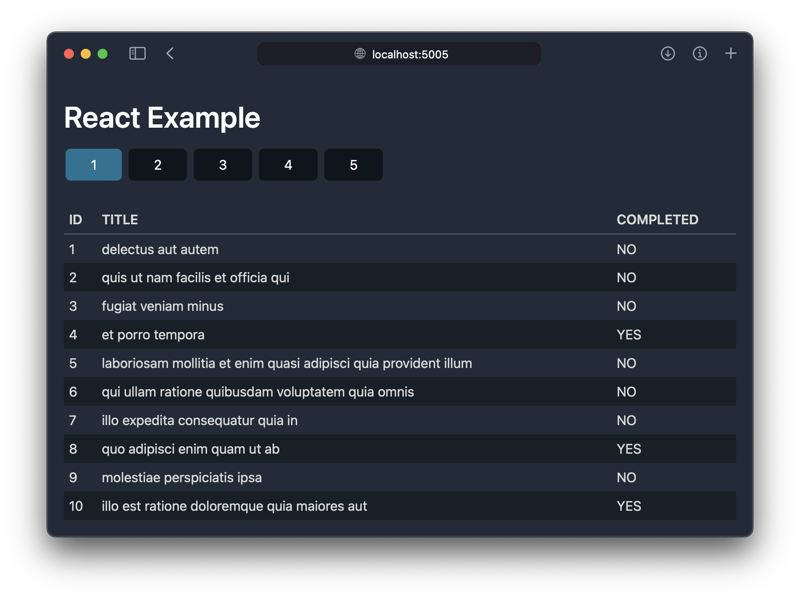

# React version



ビルドして使うには次のコマンドを実行してください。10 秒ほどでインストールとビルドが終わります。

```console
npm install
npm run build
```

できあがった `build/` ディレクトリをドキュメントルートとして Web サーバーから見れば OK です。

## 利用可能なスクリプト

### `npm start [-- --no-open]`

アプリを開発モードで起動します。ブラウザーが起動して http://localhost:5005 が表示されます。
ブラウザーを起動したくないときは `-- --no-open` オプションを渡してください。

ソースコードを編集すると、必要なコンポーネントが再読み込みされます。

TypeScript による型検査は別コンソールで実行してください。

### `npm run build`

アプリを静的資材として `build/` ディレクトリにコピーします。
そのディレクトリをデプロイすれば OK です！

### `npm run format`

ソースコードを整形します。
