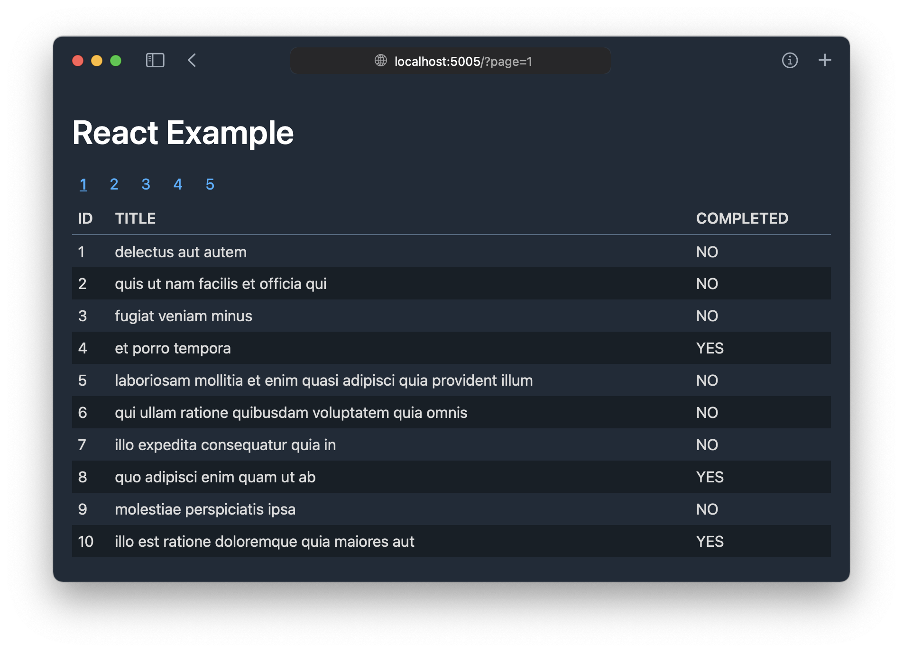

# React version

## 利用可能なスクリプト

### `npm start [-- --no-open]`

アプリを開発モードで起動します。ブラウザーが起動して http://localhost:5005 を表示します。
ブラウザーを起動したくないときは `-- --no-open` オプションを渡してください。

ソースコードを編集すると、必要なコンポーネントが再読み込みされます。

TypeScript による型検査は別コンソールで実行してください。
